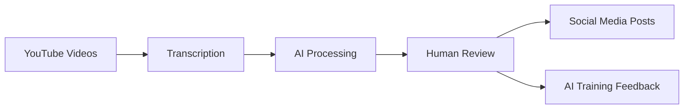

# Human Feedback Web Application

## Table of Contents
- [Overview](#overview)
- [System Architecture](#system-architecture)
- [Installation](#installation)
- [Usage Guide](#usage-guide)
- [Development Guide](#development-guide)
- [Technical Components](#technical-components)
- [Testing](#testing)

## Overview
The Human Feedback Web Application helps review and improve autonomously generated highlights from YouTube videos. It's designed to:
- Review highlights extracted from long-form YouTube videos
- Collect human feedback on highlight quality
- Train the autonomous system to better identify engaging content
- Prepare approved content for social media publication

## System Architecture


### Process Flow
1. **Content Sourcing**: Import videos from selected YouTube channels
2. **Processing Pipeline**:
   - Extract video transcripts
   - Clean and polish transcripts using AI
   - Generate highlight suggestions
3. **Review System**:
   - Human reviewers approve/reject highlights
   - Feedback collected for AI improvement
4. **Publication**: Approved highlights prepared for social media

## Installation

### Backend Setup
```bash
# Create virtual environment
python -m venv venv
source venv/bin/activate  # Windows: .\venv\Scripts\activate

# Install dependencies
pip install -r requirements.txt

# Initialize database
python backend/init_database.py

# Start server (from human_feedback_webapp folder)
uvicorn backend.main:app --reload
```

### Frontend Setup
```bash
cd frontend
npm install
npm start
```

## Usage Guide

### Getting Started
1. Access the application at http://localhost:3000
2. Add YouTube channels in the Dashboard
3. Review generated highlights from the Video Queue

### Review Interface
- Split-screen layout:
  - Left: Full video transcript
  - Right: Highlight cards for review
- Keyboard shortcuts:
  - `A` - Approve highlight
  - `R` - Reject highlight
  - `←/→` - Navigate highlights

## Development Guide

### Key Resources
- API documentation: http://localhost:8000/docs
- Database location: `data/app.db`
- Frontend code: `frontend/src/`

### Main Components

#### Dashboard (`Dashboard.jsx`)
- Channel management interface
- Video queue monitoring
- Processing status tracking

#### Highlight Review (`HighlightReview.jsx`)
- Split-screen review interface
- Approval/rejection functionality
- Progress tracking

## Technical Components

### AI Integration
The system uses AI (ChatGPT) for:
- Transcript enhancement
- Highlight generation
- Learning from human feedback

### Feedback System
- Records reviewer decisions
- Analyzes rejection patterns
- Improves AI highlight generation
- Maintains quality control

## Testing
```bash
# Run all tests
pytest

# Run specific test file
pytest human_feedback_webapp/backend/tests/test_youtube_service.py

# Verbose output
pytest -v human_feedback_webapp/backend/tests/test_youtube_service.py

# Include print statements
pytest -v -s human_feedback_webapp/backend/tests/test_youtube_service.py
```

---

**Note**: This application requires both backend (FastAPI) and frontend (React) servers running simultaneously. The backend handles data processing and storage, while the frontend provides the user interface.